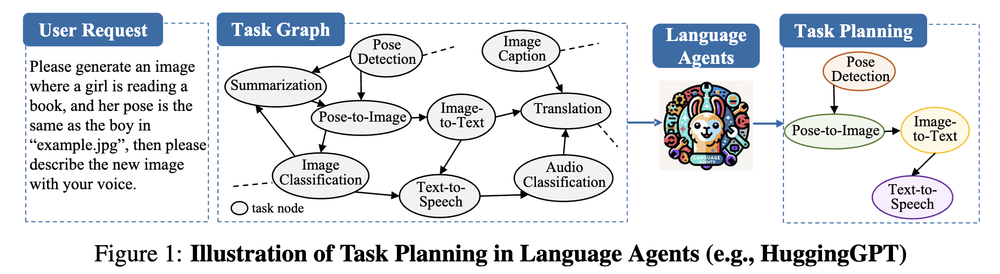

# Can Graph Learning Improve Task Planning?


  [](https://arxiv.org/abs/2405.19119)


This is the official implementation for paper "Can Graph Learning Improve Task Planning?"

###  




Task planning aims to break down complex user request into solvable sub-tasks, thereby fulfilling the original request. In this context, the sub-tasks can be naturally viewed as a graph where nodes represent the sub-tasks, and the edges denote the dependencies among them. Consequently, task planning is a decision-making problem that involves selecting a connected path within the corresponding graph and invoking it. In this paper, we first provide theoretical analysis, showing that **the biases of attention and auto-regressive loss impede LLM's ability to effectively solve decision-making on graphs**. Based on the theoretical analysis, we **introduce an additional GNN for sub-task retrieval, available in both training-free and training-based variants**. The experiments on diverse LLMs and planning benchmarks demonstrate that the proposed method outperforms existing solutions with much less computation time. Furthermore, the performance is further enhanced by improved prompts or a fine-tuned model.


> Feel free to cite this work if you find it useful to you! 😄
```
@article{wu2024graph,
  title={Can Graph Learning Improve Task Planning?},
  author={Xixi Wu and Yifei Shen and Caihua Shan and Kaitao Song and Siwei Wang and Bohang Zhang and Jiarui Feng and Hong Cheng and Wei Chen and Yun Xiong and Dongsheng Li},
  journal={arXiv preprint arXiv:2405.19119},
  year={2024}
}
```


### 🔥 Updates

- *May 30 2024* 📚 We posted the first version of our paper! 
- *May 29 2024* 🚀 We released the datasets and codes of GNN4TaskPlan!


---

## Table of Contents

- [Can Graph Learning Improve Task Planning?](#can-graph-learning-improve-task-planning?)
   - [Table of Contents](#table-of-contents)
   - [Environment Setup](#environment-setup)
       - [Deploy Open-sourced LLMs](#deploy-open-sourced-llms)
   - [Overview](#overview)
   - [Datasets](#datasets)
   - [Training-free Methods](#training-free-methods)
       - [Code Intro](#code-intro)
       - [Reproducibility](#reproducibility)
   - [Training GNNs](#training-gnns)
   - [Fine-tuning LLMs](#fine-tuning-llms)
   - [Evaluation](#evaluation)
   - [TODO](#todo)


## Environment Setup

```shell
pip install -r requirements.txt
```

Run the above command to install required Python packages.

### Deploy Open-sourced LLMs

For running LLM's direct inference or GraphSearch, our codes are implemented as deploying LLMs as API services using [`FastChat`](https://github.com/lm-sys/FastChat) to the `localhost:8008` endpoint. 

* **Installing FastChat** 
  ```shell
  pip3 install "fschat[model_worker,webui]"
  pip3 install vllm
  ```

* **Deploying LLM**
  ```shell
  python3 -m fastchat.serve.controller --host 127.0.0.1 

  # Specify the LLM to be deployed, take CodeLlama-13B as an example
  python3 -m fastchat.serve.vllm_worker --model-path codellama/CodeLlama-13b-Instruct-hf --host 127.0.0.1
  # Commands for other experimental LLMs
  # python3 -m fastchat.serve.vllm_worker --model-path lmsys/vicuna-13b-v1.5 --host 127.0.0.1
  # python3 -m fastchat.serve.vllm_worker --model-path codellama/CodeLlama-7b-Instruct-hf --host 127.0.0.1
  # python3 -m fastchat.serve.vllm_worker --model-path mistralai/Mistral-7B-Instruct-v0.2 --host 127.0.0.1
  # python3 -m fastchat.serve.vllm_worker --model-path baichuan-inc/Baichuan2-13B-Chat --host 127.0.0.1
  
  python3 -m fastchat.serve.openai_api_server --host 127.0.0.1 --port 8008
  ```

  If you use devices from platforms like AutoDL, using the following scripst to depoly the LLM services
  ```shell
  python3 -m fastchat.serve.controller --host 0.0.0.0 
  # `--model-path` example local path of the LLM
  # `--num-gpus` number of available GPUs
  python3 -m fastchat.serve.vllm_worker --model-path /root/autodl-tmp/models/AI-ModelScope/Mistral-7B-Instruct-v0.2 --host 127.0.0.1  --num-gpus 2 
  python3 -m fastchat.serve.openai_api_server --host 127.0.0.1  --port 8008 
  ```


## Overview 
```
.
├── README.assets    
├── README.md       
├── data                           --> Provide 4 datasets, dataset splits code and processing code for RestBench
│   ├── dailylife
│   ├── huggingface
│   ├── multimedia
│   ├── raw                        --> Original files from RestBench
│   │   └── RestBench
│   ├── raw_process_restgpt.py     --> Codes for processing RestBench
│   ├── split_data.py              --> Codes for splitting test-set
│   └── tmdb
├── evaluate.py                    --> Codes for evaluation 
├── finetunellm                    --> Codes for fine-tuning LLMs and then make direct inference based on fine-tuned LLMs
├── finetunellm_script.sh          --> Scripts for fine-tuning LLMs
├── prediction                     --> Results of Task Planning
├── requirements.txt     
├── trainfree                      --> Codes for training-free methods (Direct, GraphSearch, and SGC)
├── trainfree_script.sh            --> Scripts for training-free methods
├── traingnn                       --> Codes for training GNNs
├── traingnn_reproduce.sh          --> Scripts for reproducing reported GNN / LM+GNN results
└── utils                 
```

This repo provides both training-free and training-based methods. Besides, we provide source codes for fine-tuning LLMs using LoRA on splitted training data. Explanations of these contents will be detailed as follows.


## Datasets

Four experimental datasets (HuggingFace, Multimedia, Daily Life from [TaskBench](https://github.com/microsoft/JARVIS/blob/main/taskbench/README.md), and TMDB from [RestBench](https://github.com/Yifan-Song793/RestGPT)) are under the **`data`** folder. 

Each dataset contains the following files:
* `data.json` Detailed dataset, with each sample has a user request, ground-truth decomposed task steps, and task invocation path
* `graph_desc.json` Detailed task graph 
* `tool_desc.json` Only present the nodes' information within the task graph
* `user_requests.json` Original user requests
* `split_ids.json` Give the formal split of test samples


As dataset from RestBench only contains orignal request and ground-truth API sequences, we have reformatted this dataset to align with experiments, including assigning a unique name to each API, constructing a task graph, and finally reformatting original data samples. Processing details are covered in `raw_process_restgpt.py`.


## Training-free Methods 

### Code Intro
Codes of training-free modes are under the **`trainfree`** folder:
* **Direct** LLM's direct inference (default setting - 1-shot in-context learning). Implementation refers to [TaskBench](https://github.com/microsoft/JARVIS/blob/main/taskbench/README.md).
* **GraphSearch** LLM performs iterative search on the task graph to select an optimal invocation path, including GreedySearch, AdaptiveSearch, and BeamSearch three variants. Implementation refers to [ControlLLM](https://github.com/OpenGVLab/ControlLLM/blob/main/cllm/services/tog/tool.py).
* **SGC** Our training-free SGC method.

Besides, we also provide two improved prompt templates, **2-shot** and **PlaG**, to investigate the orthogonal effectiveness of our method. 

```
├── trainfree
│   ├── direct.py               --> LLM's direct inference
│   ├── direct_diffprompt.py    --> LLM's direct inference under improved prompts, including 1) more in-context learning examples and 2) plan like a graph (PlaG)
│   ├── graphsearch.py          --> GraphSearch method
│   └── sgc.py                  --> SGC method
```

### Reproducibility

Running scripts can be found in `trainfree_script.sh`. 

**Hint** You have to first run the Direct Inference to obtain any LLM's direct inference results to facilitate SGC or GraphSearch.


## Training GNNs

Codes of training-based GNNs are under the **`traingnn`** folder:
```
├── traingnn
│   ├── gnn.py              --> GNN encoder implementation, including SGC, GCN, GAT, SAGE, GIN, and TransformerConv
│   ├── main.py             --> Training GNN and then testing the performance
│   ├── model.py            --> LM+GNN model
│   └── sampler.py          --> Sampling object to prepare training triplets `<step, positive task, negative task>`
├── traingnn_reproduce.sh   --> Scripts for reproducing all experimental results
```

Specifically, we explain the core arguments of `main.py`:
* `lm_name`: Name of LM encoder with default choice as `intfloat/e5-large`
* `gnn_name`: Name of GNN encoder with choices `[SGC, GCN, GAT, SAGE, GIN, TransformerConv]`
* `gnn_hidden_dim`: Dimension of hidden layers within GNN
* `num_negatives`: Number of negative samples per positive task with default setting as `2`
* `text_negative`: Whether the negative samples are textually similar to positive task
* `lm_frozen`: Whether the parameters of LM are frozen. `1` denotes the GNN-only mode and `0` denotes the LM+GNN co-trained mode.

```shell
# HuggingFace - GNN only
python main.py --lm_frozen=1 --epoch=10 --text_negative=1 --gnn_name=SAGE --lr=0.001

# HuggingFace - LM+GNN co-train
python main.py --lm_frozen=0 --epoch=20 --text_negative=1 --gnn_name=SAGE
```

More running scripts can be found in `traingnn_reproduce.sh`. 


## Fine-tuning LLMs

```
├── finetunellm
│   ├── inference.py         --> Direct inference of fine-tuned LLMs
│   ├── main.py              --> Fine-tuning LLM
│   └── user_prompt.py       --> Instruction Template
```

Codes of fine-tuning LLMs are under the **`finetunellm`** folder:
* **LLM Fine-tune**  Using LoRA to fine-tune a LLM with training data coming from the ground-truth `<user_request, decomposed task steps, task invocation path>` triplets. During experiments, we fine-tune LLMs of different parameter scales, including **[CodeLLaMA-7B](https://huggingface.co/codellama/CodeLlama-7b-Instruct-hf)** and **[Vicuna-13B](https://huggingface.co/lmsys/vicuna-13b-v1.5)**.
* **Inference based on Fine-tuned LLMs** Making direct inference based on fine-tuned LLMs. You have to specify the LLM's name and the ckpt_dir. 

Running scripts can be found in `finetunellm_script.sh` and we use 2 NVIDIA A100-80G GPUs for fine-tuning LLMs.


## Evaluation

`evaluate.py` provides a evaluation of task planning result, and metrics including `Node-F1`, `Link-F1`, `Node-Hallucination` (both Macro and Micro), and `Link-Hallucination` (both Macro and Micro).

To facilitate reproducibility, we have provided the direct inference results of CodeLLaMA-13B and Mistral-7B on HuggingFace dataset under the `prediction` folder.

For evaluation, you have to specify the LLM's name, dataset, and the method (for example, `direct` denotes LLM's direct inference):
```shell 
python evaluate.py --llm=CodeLlama-13b --dataset=huggingface --method=direct
```

And the result is as follows (`NF` - Node-F1, `LF` - Link-F1, `NH-1` - Micro Node Hallucination Rate, `NH-2` - Macro Node Hallucination Rate, `LH-1` - Micro Link Hallucination Rate, `LH-2` - Macro Link Hallucination Rate):
```
+-------------+---------------+-------+--------+--------+--------+--------+--------+--------+
|   Dataset   |      LLM      |  Mode |   NF   |   LF   |  NH-1  |  NH-2  |  LH-1  |  LH-2  |
+-------------+---------------+-------+--------+--------+--------+--------+--------+--------+
| huggingface | CodeLlama-13b | chain | 0.5755 | 0.2888 | 0.1656 | 0.4306 | 0.4228 | 0.6338 |
+-------------+---------------+-------+--------+--------+--------+--------+--------+--------+
```


## TODO 

- [x] [Code] Release all related codes of open-sourced LLMs
- [ ] [Code] Release training-free codes of GPT-series
- [ ] [Docs] Provide a Chinese version README
- [x] [Result] Provide direct inference results of several LLMs
- [ ] [Resource] Provide ckpt of both GNN and LM+GNN for reproducibility

      
